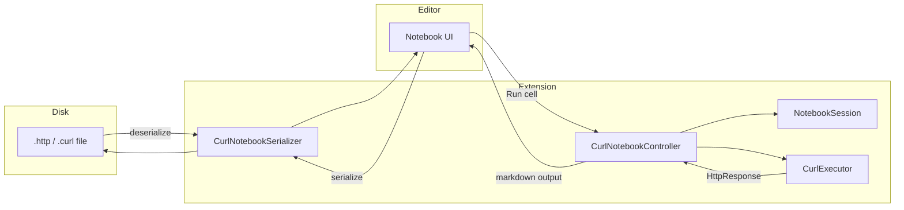

# vscode-curl-notebook — architecture

This extension mirrors the [SQL Notebook](https://marketplace.visualstudio.com/items?itemName=cmoog.sqlnotebook) model: a **plain-text file on disk**, a **serializer** that maps it to VS Code notebook cells, and a **controller** that executes cells and renders output.

## VS Code notebook pipeline

## Modules

| Module | Responsibility | Pattern |
|--------|----------------|---------|
| `curl-notebook-serializer.ts` | File bytes ↔ `NotebookData` | Adapter |
| `curl-notebook-controller.ts` | Run cells, write outputs | Controller |
| `cell-splitter.ts` | `###` vs double-empty-line cells | Strategy |
| `variable-parser.ts` | `@var`, `# @name`, curl extraction | Parser |
| `variable-store.ts` | Workspace + session variables | Repository |
| `response-store.ts` | Named `# @name` responses | Repository |
| `variable-substitutor.ts` | `{{…}}` replacement | Template method |
| `curl-executor.ts` | `spawn(curl)` → `HttpResponse` | Adapter |
| `response-formatter.ts` | `HttpResponse` → markdown | Presenter |
| `curl-completion-provider.ts` | Flags, snippets, variables | Completion |
| `notebook-session.ts` | Per-document state | Session |

## Cell delimiters

| Mode | Rule | Typical use |
|------|------|-------------|
| `triple-hash` | Line containing only `###` | REST Client `.http` |
| `double-newline` | Two consecutive empty lines | SQL Notebook style |
| `auto` | `###` if present, else double-empty | Default |

A **single** blank line inside a cell is preserved in `double-newline` mode.

## Variable resolution order

1. Session variables (`@name = …` in prior cells)
2. Workspace settings (`curlNotebook.variables`)
3. Dotenv (when `curlNotebook.loadDotenv` is true)
4. Named responses (`{{login.response.body.token}}` after `# @name login`)

## Security

- Requires a **trusted workspace** (`package.json` capability).
- Executes the real `curl` binary with user-provided arguments.
- Masks sensitive variable values in the tree view when names match `token|password|secret|key`.

## Extension points

To add a new cell delimiter, implement `ICellSplitter` and register the mode in settings + `CellSplitter.resolveMode`.

To swap HTTP execution (e.g. `fetch` instead of curl), implement `ICurlExecutor` and inject it into `CurlNotebookController`.
